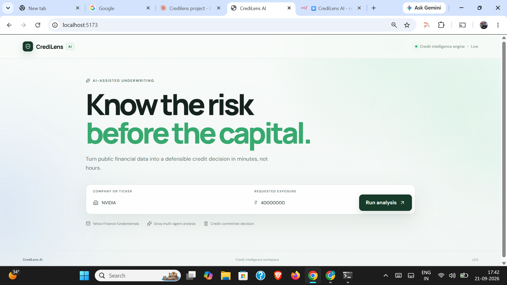
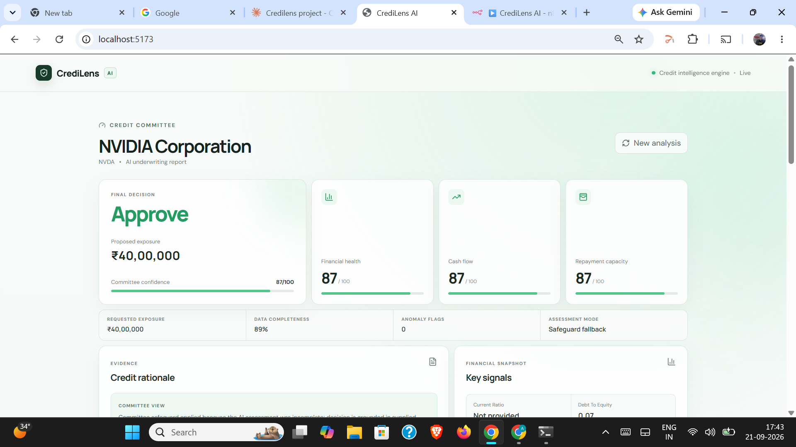
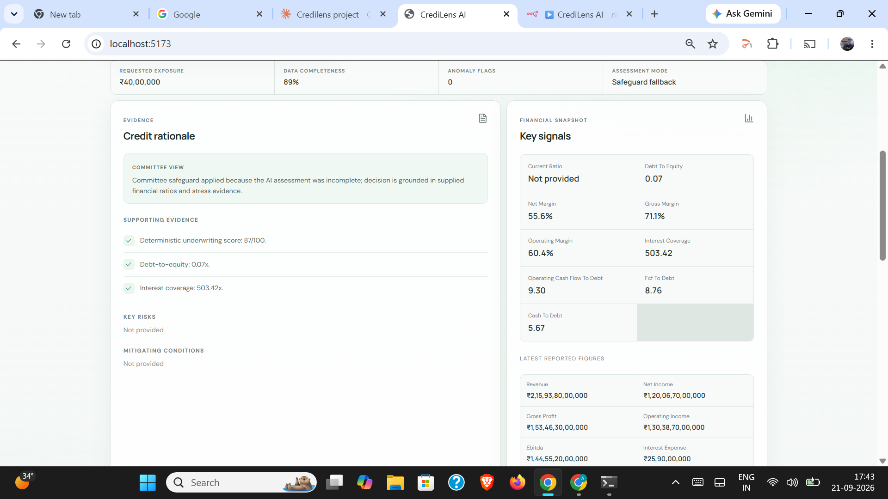
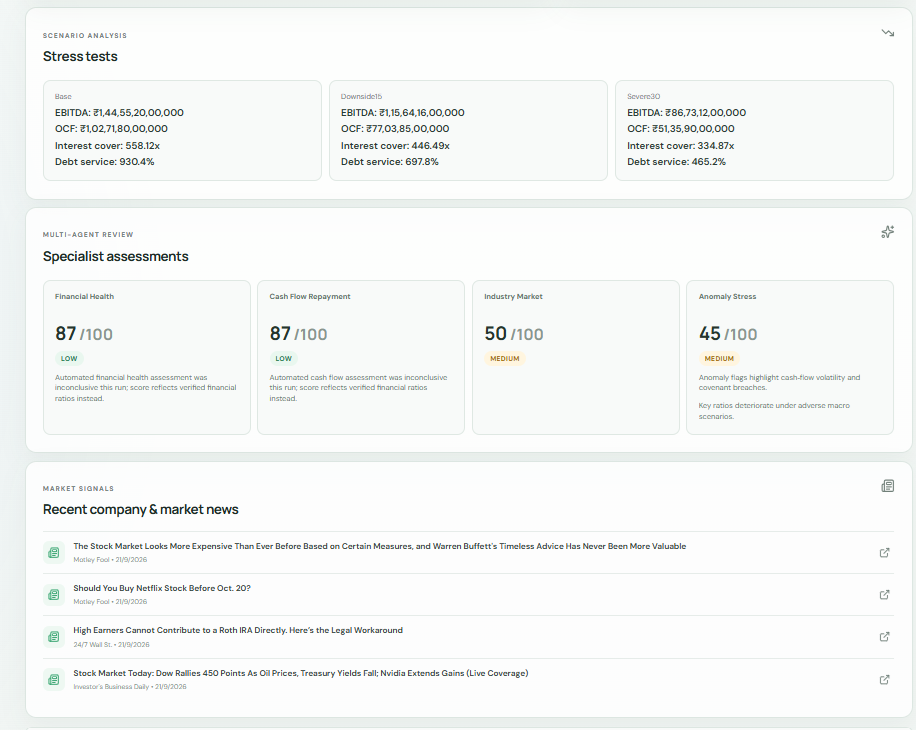
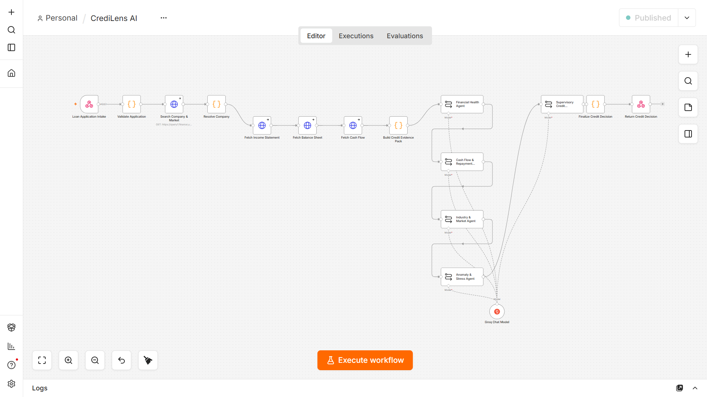

# CrediLens AI - Automated Credit Underwriting Engine

**Turns public financial data into a defensible credit decision in minutes, not hours.**

CrediLens AI is an automated credit risk analysis system that takes a company name and a requested loan amount, pulls live financial statements, runs ratio analysis and 3-scenario stress testing, and produces a committee-reviewed Approve/Review/Reject decision with full supporting evidence — replacing what is typically a manual, multi-hour underwriting review.



## Why this exists

Manual credit underwriting is slow and inconsistent — analysts pull financials from multiple sources, compute ratios by hand, and judgment calls vary reviewer to reviewer. CrediLens AI standardizes this into a repeatable pipeline: same inputs, same ratio methodology, same stress scenarios, every time — with a clear audit trail behind every decision.

## What it does

1. **Company resolution & data ingestion** :- resolves a company name/ticker and pulls live income statement, balance sheet, and cash flow data from Yahoo Finance
2. **Ratio analysis & stress testing** :- computes standard credit ratios (debt-to-equity, interest coverage, cash-to-debt, etc.) and stress-tests them across three scenarios: Base, 15% Downside, and 30% Severe Downside
3. **Specialist risk assessment** :- four independent analytical passes evaluate the company from different angles: Financial Health, Cash Flow & Repayment, Industry & Market, and Anomaly & Stress detection
4. **Committee decision synthesis** :- a final review step combines all four assessments into one Approve / Review / Reject recommendation with a confidence score and written rationale
5. **Deterministic safeguard layer** :- if any automated assessment step is inconclusive on a given run, the system falls back to a score computed directly from verified financial ratios, so the output is never broken or blank — every report states clearly when this fallback was used

## Example output

**Decision summary** - final call, confidence score, and category-level breakdown:


**Credit rationale** - the reasoning behind the decision, backed by actual computed ratios (debt-to-equity, interest coverage, margins) rather than a black-box score:


**Stress testing & specialist scores** - resilience under adverse scenarios, plus the four independent risk assessments with severity flags:


## Architecture

Built on a workflow-orchestration backend (n8n) rather than a single prompt-and-response call, so each stage — data fetch, ratio computation, specialist assessment, committee synthesis — is a separate, inspectable, independently testable step:



## Tech stack

- **Workflow orchestration:** n8n (self-hosted via Docker)
- **Data pipeline:** Yahoo Finance API for live financial statement data
- **Analysis layer:** custom ratio computation + stress-test scenario modeling
- **Frontend:** React + TypeScript + Vite
- **Styling:** custom CSS

## Key design decisions

- **Deterministic safeguards over blind automation.** Any inconclusive automated assessment falls back to a score computed directly from verified financial ratios (debt-to-equity, interest coverage, cash flow coverage), and the report always labels when this happened — so output reliability doesn't depend on a single step succeeding.
- **Scenario-based stress testing**, not just point-in-time health. Every company is scored under Base, 15% Downside, and 30% Severe Downside conditions to assess resilience, not just current standing.
- **Data completeness tracking.** Missing financial fields are tracked and factored into a confidence score rather than silently ignored — so a thin data run is visibly flagged, not masked.

## Setup

### 1. Backend (n8n workflow)

```bash
docker run -d --name n8n -p 5678:5678 -v ~/.n8n:/home/node/.n8n --restart unless-stopped n8nio/n8n
```

Then:
1. Open `http://localhost:5678` and import [`n8n/n8n-workflow.json`](n8n/n8n-workflow.json)
2. Add an API credential on the LLM node (see workflow for provider)
3. Click **Publish** to activate the webhook

### 2. Frontend

```bash
cd CrediLens-Frontend
npm install
npm run dev
```

The frontend expects the backend webhook at `http://localhost:5678/webhook/credilens-auto-company-analysis` (configurable via `.env`).

## Project report

Full methodology and write-up in [`docs/`](docs).
